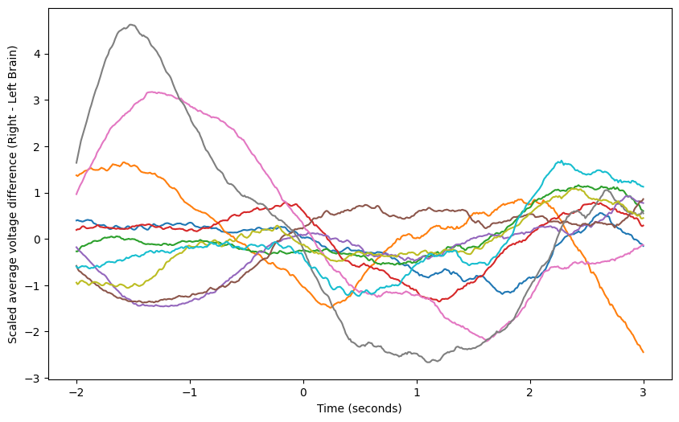

# Portfolio

Hi there! My name is Fernando Herrera. I'm a 100% mexican made Biomedical Engineer, born and raised in the city of Monterrey, Mexico. I have a passion for exploring topics about health, physics and music. This portfolio encapsulates that passion and showcases my journey in the field of data analytics and data science, through a collection of projects which have let me develop technical and analytical skills such as data manipulation and visualization, critical thinking and problem solving, but most of all, **perseverance**. There is a whole world of information available to everyone, and I believe that learning how to learn from that information and how to transform challenges into growth opportunities is something everybody should invest in mastering, regardless their field of expertise!

## Projects

### EEG Classification: Animals and Objects

> During this project, the EEG dataset of 15 male subjects was extracted, visualized 
> and pre-processed to attempt obtaining an accurate binary classification neural network
> using Pytorch, predicting wether a subject is identifying the picture of an animal or of 
> an object.

[Take me to the project!](./another-page.html).

