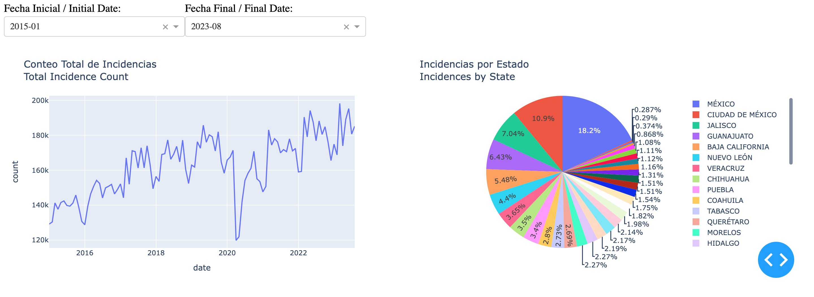
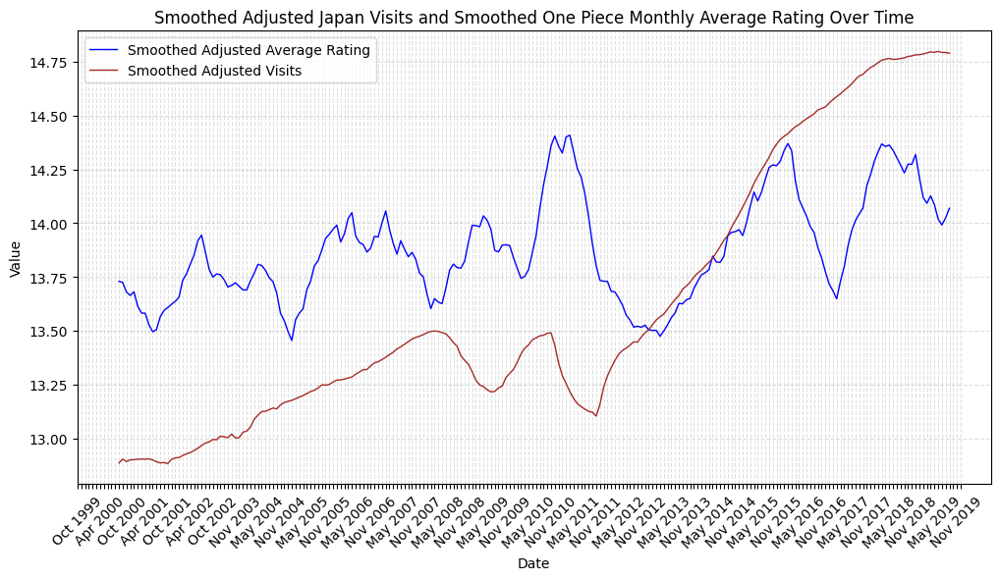
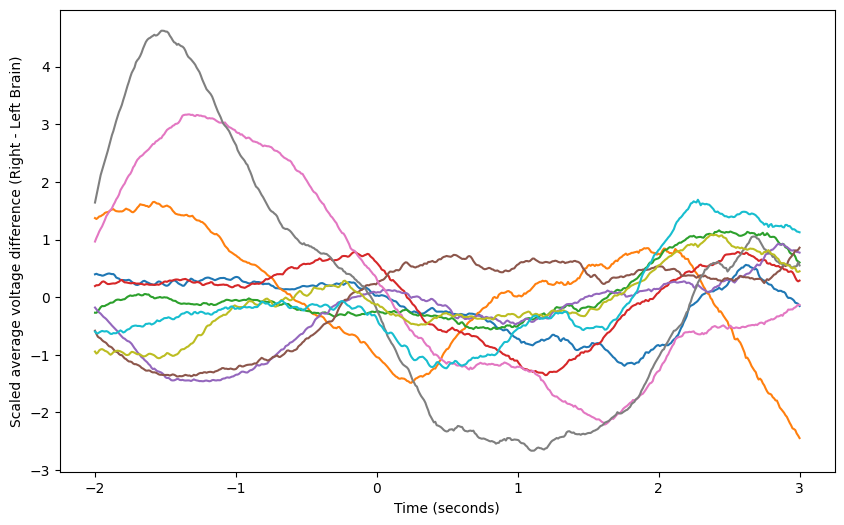

# Hi there!

My name is Fernando Herrera. I'm a 100% mexican made Biomedical Engineer, born and raised in the city of Monterrey, Mexico. I have a passion for exploring topics about health, physics and music. This portfolio encapsulates that passion and showcases my journey in the field of data analytics and data science, through a collection of projects which have let me develop technical and analytical skills such as data manipulation and visualization, critical thinking and problem solving, but most of all, **perseverance**. There is a whole world of information available to everyone, and I believe that learning how to learn from that information and how to transform challenges into growth opportunities is something everybody should invest in mastering, regardless their field of expertise!

 

 

## **Projects**

### **Crime Data in Mexico From 2015 to 2023**  _(Data Visualization)_
##### **Skills Applied:** Python, Pandas, Dash (HTML, CSS), Plotly Express

> This project consists in the creation of an interactive web app using Dash,
> in order to meaningfully visualize crime data from different states in Mexico
> during 2015 and 2023. The dashboard allows the user to select one or more of
> the 32 Mexican states, the affected legal assets, crime types, subtypes and modalities,
> aswell as the initial and final dates to consider in the analysis. The information
> is shown as a line plot for the total crime count during the time window for the given 
> states, and crime details, as well as a pie chart to compare the crime count for each state 
> if two or more states are selected.

[Take me to the project!](https://github.com/fhg99/fhg99.github.io/blob/main/Projects/Data/DataAnalysis/MexicoCrimeDashboard/dashboard.ipynb)

### **Anime Impact on Japanese Overseas Visits** _(Data Analysis)_
##### **Skills Applied:** Python, Pandas, BeautifulSoup (Web Scraping), Seaborn/Matplotlib

> For this project, I obtained a public dataset provided by the japanese government,
> containing overseas visits history data from all around the world. I performed web-
> scraping on the IMDb One Piece episodes info and rating webpage in order to obtain
> the rating of every one of show's episodes. Finalll, I used this data to determine
> if there is a correlation between the average montly rating of the show and the
> overseas visits to Japan during that same month. Additionally, I added a scrapping
> script at the end in order to scrape all of the episodes' information including:
> episode number, title, plot, release date and average rating.

[Take me to the project!](https://github.com/fhg99/fhg99.github.io/blob/main/Projects/Data/DataAnalysis/AnimeAndJapanTourism/animeandjapantourism.ipynb)

### EEG Classification: Animals and Objects

> During this project, the EEG dataset of 15 male subjects was extracted, visualized 
> and pre-processed to attempt obtaining an accurate binary classification neural network
> using Pytorch, predicting wether a subject is identifying the picture of an animal or of 
> an object.

[Take me to the project!](./another-page.html)

